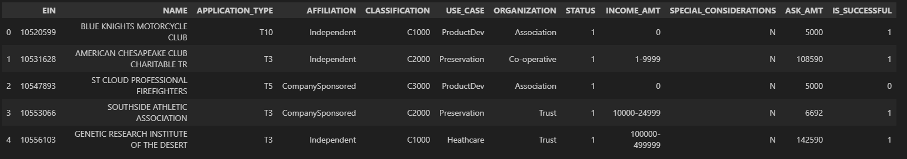

# deep-learning-alphabet soup challenge

This project is created for the University of Minnesota = Data Visualization and Analytics Bootcamp - Module 21 Neural Networks and Deep Learning Challenge.

### Contributor : Indu Bandi

# Project Overview

In this project, we will use machine learning and neural networks to create a classifier that can help identify the applicants for funding with the best chance of success in their ventures, if funded by Alphabet Soup.

The dataset for funding was provided as CSV from AWS S3 bucket to access in Google Colab Notebook.

This project uses SciKit-Learn, TensorFlow and Pandas.

# Data Prep

CSV file downloaded from S3 Bucket contains the below attributes:

1. EIN and NAME — Identification columns
2. APPLICATION_TYPE — Alphabet Soup application type
3. AFFILIATION — Affiliated sector of industry
4. CLASSIFICATION — Government organization classification
5. USE_CASE — Use case for funding
6. ORGANIZATION — Organization type
7. STATUS — Active status
8. INCOME_AMT — Income classification
9. SPECIAL_CONSIDERATIONS — Special considerations for application
10. ASK_AMT — Funding amount requested
11. IS_SUCCESSFUL — Was the money used effectively

Target for the model is identified as `IS_SUCCESSFUL` column of the dataframe and hence this column is removed from the dataset so the model is more accurate.

The features for the model are:

1. APPLICATION_TYPE
2. AFFILIATION
3. CLASSIFICATION
4. USE_CASE
5. ORGANIZATION
6. STATUS
7. INCOME_AMT
8. SPECIAL_CONSIDERATIONS
9. ASK_AMT

Below variables were removed because they were neither targets nor features:

1. EIN
2. NAME

After identifying the features from target and removing the unwanted columns, determined the unique values in each column. Examined the number of unique values for each column mainly APPLICATION_TYPE and CLASSIFICATION and grouped the values together for value_counts < 500 for APPLICATION and < 1000 for CLASSIFICATION and named them as  `Others` 

Used pandas get_dummies to encode the data and the number of columns increased from 9 to 43. 

Scaled the data using Standard Scaler by SciKit-Leatn and then split the scaled data into training and testing sets with default proportion of 70/30.

# Initial Neural Network Model

Initial Neural Network Model created is: [deep_learning_challenge.ipynb](deep_learning_challenge.ipynb). For this model, used TensorFlow Keras model input layer with 43 input dimensions, 150 nodes and ReLu activation function. 
Hidden Layer also has 150 nodes with ReLu activation function. 
Output Layer has 1 node with sigmoid activation function.

This model was trained on 100 epochs and achieved a goal of 73% accuracy with a loss of 57.29%.

# First Optimization

First optimization attempt neural network model is: [deep_learning_challenge_optimization_1](optimizations/deep_learning_challenge_optimization_1.ipynb). For this model, used TensorFlow Keras model input layer with 43 input dimensions, 30 nodes and ReLu activation function. 
First hidden Layer has 30 nodes wiht ReLu activation function. 
Second hidden Layer also has 30 nodes with ReLu activation function. 
Output Layer has 1 node with sigmoid activation function.

This model was trained on 100 epochs and achieved a goal of 73% accuracy with a loss of 56.02%

# Second Optimization

Second optimization attempt neural network model is: [deep_learning_challenge_optimization_2](optimizations/deep_learning_challenge_optimization_2.ipynb). For this model, used TensorFlow Keras model input layer with 43 input dimensions, 100 nodes and ReLu activation function. 
First hidden Layer has 100 nodes wiht ReLu activation function. 
Second hidden Layer also has 50 nodes with ReLu activation function. 
Output Layer has 1 node with sigmoid activation function.

This model was trained on 100 epochs and achieved a goal of 72.75% accuracy with a loss of 57.56%

# Third Optimization

Third optimization attempt neural network model is: [deep_learning_challenge_optimization_3](optimizations/deep_learning_challenge_optimization_3.ipynb). For this model, used TensorFlow Keras model input layer with 43 input dimensions, 100 nodes and ReLu activation function. 
First hidden Layer has 100 nodes wiht ReLu activation function. 

Added a dropout layer to prevent overfitting with a dropout of 0.5. The parameter 0.5 indicates the fraction of the input units to drop. In this case, it means that during each training step, 50% of the neurons in the preceding layer will be set to 0.

Output Layer has 1 node with sigmoid activation function.

This model was trained on 100 epochs and achieved a goal of 72.87% accuracy with a loss of 55.48%.

# Summary

The Neural Network models tried here did not meet the expectation of 75% accuracy but overall the models did a decent job of predicting whether the charities received funding with their success ventures.

The modifications I performed did not seem to improve the performance, I'm wondering if modifying the input dimensions could alter the performance in any way and also explore if there are any other models that we could try out with.

All the neural network models have been saved as h5 models as requested in the challenge and saved under:
1. [Initial_deep_learning_challenge.h5](deep_learning_challenge.h5)
2. [deep_learning_optimization_1.h5](optimizations/deep_learning_optimization_1.h5)
3. [deep_learning_optimization_2.h5](optimizations/deep_learning_optimization_2.h5)
4. [deep_learning_optimization_3.h5](optimizations/deep_learning_optimization_3.h5)

